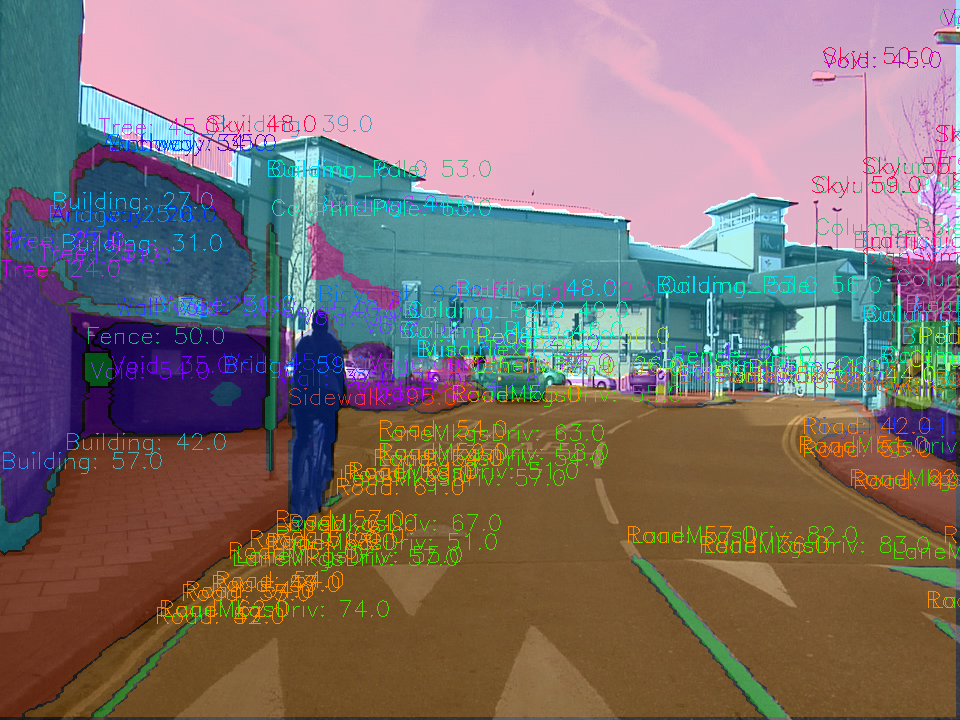
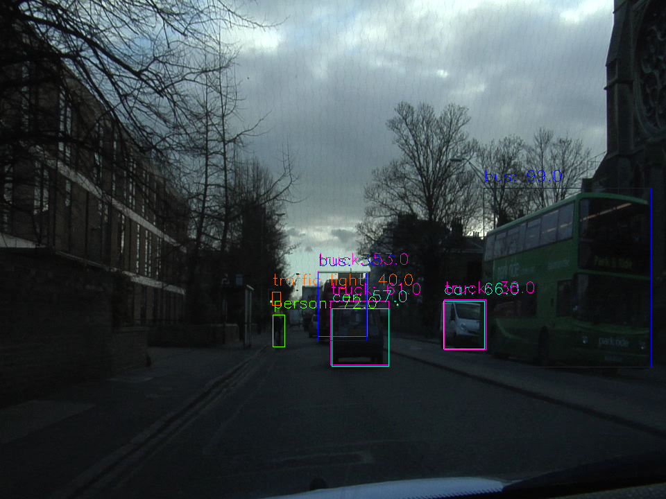
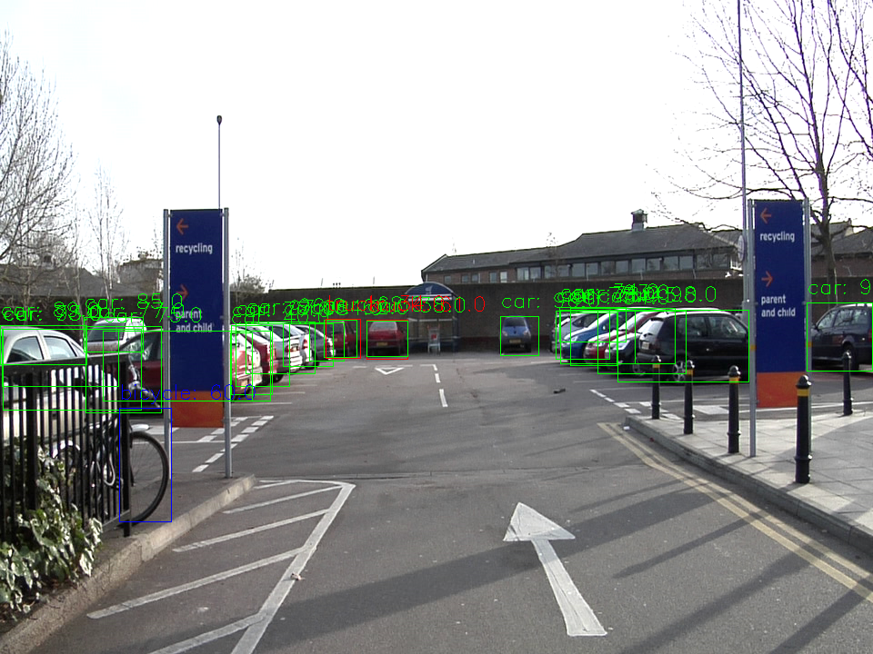

# Semantic Segmentation
### Introduction

The goal of this project was to implement a fully convolutional network in order to classify images from a dashcam into the road and nonroad pixels. I started by converting the provided pre-trained VGG-16 classifier to a fully convolutional network. At the [Udacity Self-Driving Car Nanodegree](https://de.udacity.com/course/self-driving-car-engineer-nanodegree--nd013) the [Kitty Dataset](www.cvlibs.net/datasets/kitti/) was used. Afterwards, I used the [Tiramisu](https://arxiv.org/abs/1611.09326) Architecture on the [CamVid Dataset](http://mi.eng.cam.ac.uk/research/projects/VideoRec/CamVid/) and was able to reproduce nearly the accuracy defined in the paper.  

|  | 
|:--:| 
| *Results of the Tiramisu Network trained on CamVid with 32 different classes.* |

### Semantic Segmentation

Semantic Segmentation is the process of assigning each pixel of an image to their corresponding class. 
There are a couple of different approaches to performing semantic segmentation.
1. One of the first approaches with Deep Learning was patch classification, where each pixel was classified by using a patch with fixed size around it. This, for example, was successfully used to segment ["Electron Micrsopy Images"](http://people.idsia.ch/~juergen/nips2012.pdf)
2. The logical next step was the [Fully Convolutional Networks(FCN)](https://arxiv.org/abs/1411.4038). For this type of Architecture  the Fully Connected Layers were replaced by Convolutional Layers. With this adaption, it was possible to handle any image size.  Derived from the FCN-Architecture two new Architectures are now state of the art.

    i. Encoder-Decoder - Architecture
The basic principle of this Architecture  is gradually reducing the spatial dimensions and aggregatimg the context information with the help of the the encoder. The decoder then recovers the spatial dimensions and object details. In the context of medical image segmentation, the [U-Net](https://arxiv.org/abs/1505.04597) is one of the most popular architectures. 

    ii. The second approach uses Dilated convolutions instead of polling layers.
To smooth the final segmentation [Conditional Random Fields](https://arxiv.org/abs/1210.5644) are used. These generally can be used after each Semantic Segmentation Network.  

### Architecture
To perform the conversion from the provided pre-trained VGG-16 network to a fully convolutional network the final fully connected layer was replaced by 1x1 convolutions with the number of filters set to the number of target classes. In this example it was set to two (Road, No Road). The MaxPolling layer from the pre-trained network decreases the spatial accuracy. To overcome this, two skip connections performing 1x1 convolutions are implemented at layer **three** and **four**. This two skip connections are added and then  upsampled via transposed convolution. Finally, the converted fully connected layer **seven** is first upsampled and then added.     

- kernel_initializer: **random_normal_initializer(stddev=0.01)**
- kernel_regularizer: **l2_regularizer(1e-3)**

|  | 
|:--:| 
| *The provided VGG Network converted to VGG-FCN for this exercise* |

### Training:
- image_shape: 160, 576 (Even if fully connected networks can handle every input size, the accuracy is not comparable and the GPU-RAM is limited)
- epochs: 50
- batch_size: 20
- keep_prob: 0.5 (Dropout)
- Optimizier: Adam
- learning_rate: 0.001
- Augmentation: flip
```python
# performe a vertical flip for every second image 
if flip_lr and np.random.choice(2, 1)[0] == 1:
    image = np.fliplr(image)
    gt_image = np.fliplr(gt_image)
```

|  | 
|:--:| 
| *The histograms of the final conv2d_transpose layer* |


### Results:

The following image shows the batch loss of the training process. As expected, the batch loss is constantly going down and converting to 0.015. 

|  | 
|:--:| 
| *The batch loss development, for 50 or 100 epochs with and without data augmentation* |


| ** | 
|:--:| 
| *The Kitty validation images as gif* |

### [Tiramisu](https://arxiv.org/abs/1611.09326)
**I could not include the code used to create the following results in this repository. The reason beeing, that the methods and techniques used have been developed as a part of my job as a deep learnig engineer by me and my colleagues for my current employer the [EUROIMMUN AG](https://www.euroimmun.de/startseite.html). At EUROIMMUN we are using this methods and techniques to segment tissue on microscopy images, for example**

The next step up from a "simple" road segmentation was a complete street scene segmentation on the CamVid Dataset with [32](http://mi.eng.cam.ac.uk/research/projects/VideoRec/CamVid/data/label_colors.txt) classes from animal to wall. To perform this task, I implemented the Tiramisu architecture in [Keras](https://keras.io/). For data augmentation, the Keras image generator was used on the original and mask image. One of the key features of our augmentation framework based on Keras was that you can now train either all classes or just subclasses, for example only road and road line marks. To Debug the network training I developed a [Keras Callback](https://keras.io/callbacks/) that applies the current model to the validation images after a number of epochs.  The results are then saved to the [Tensorboad](https://www.tensorflow.org/get_started/summaries_and_tensorboard). This was by far the most valuable tool to debug the training process.  

### Training:
- image_shape: 224, 224
- epochs: 250
- batch_size: 6
- Optimizier: Adam
- learning_rate: 1e-4, decay=1-0.99995
- loss: categorical_crossentropy
- Augmentation: flip
```python
operations = dict(
    #rotation_range=90.,
    #width_shift_range=0.05,
    #height_shift_range=0.05,
    horizontal_flip=True,
    #vertical_flip=True,
    fill_mode="constant",  # reflect wrap, reflect
    cval=0,
    #zoom_range=0.05
    )
```
| ** | 
|:--:| 
| *The Keras Callback to visualize the training progress* |

### Results:

The pictures in the following table were processed by the Tiramisu and an R-CNN-ResNet Network. The pre-trained R-CNN used was from the [Tensorflow Object Detection API](https://github.com/tensorflow/models/tree/master/research/object_detection) model zoo. Both Models are hosted for inference at the EUROIMMUN inference service which can be called via HTTP requests. 

| [RCNN-ResNet](https://arxiv.org/abs/1506.01497) | Tiramisu | 
|:--:|:--:| 
| ** | ** |
| ** | ** |
| ** | ** |
| ** | ** |
| ** | ** |
| ** | ** |
| ** | ** |
| ** | ** |
| ** | ** |

The best validation accuracy was around 90% which is around 1% less accurate than mentioned in the original [paper](https://arxiv.org/abs/1611.09326) but way better than I expected. 

| ** | 
|:--:| 
| *Accuracy on the CamVid Dataset* |

### Open Questions:

Too much data augmentation seems to break the training process for semantic segmentation networks. For example, I was able to train the network if I shifted or fliped the image but was unable to train it with both options. 
To overcome this behavior I tried the following:
- learning_rate: Increase or decrease seemed to have no effect. The accuracy was not going to be as high as without augmentation
- First, flip then, shift: No effect. The accuracy was actually going down after starting to train the network trained with flip with a shift.

If someone has an explanation or a tip regarding this problem, I will be happy to receive a message. :)

