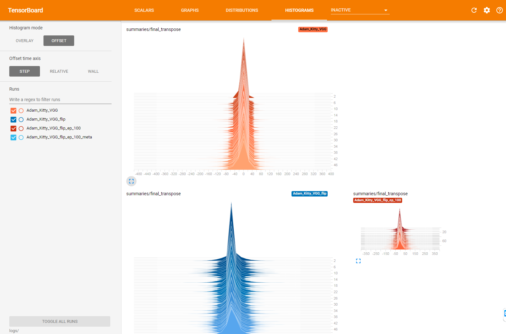
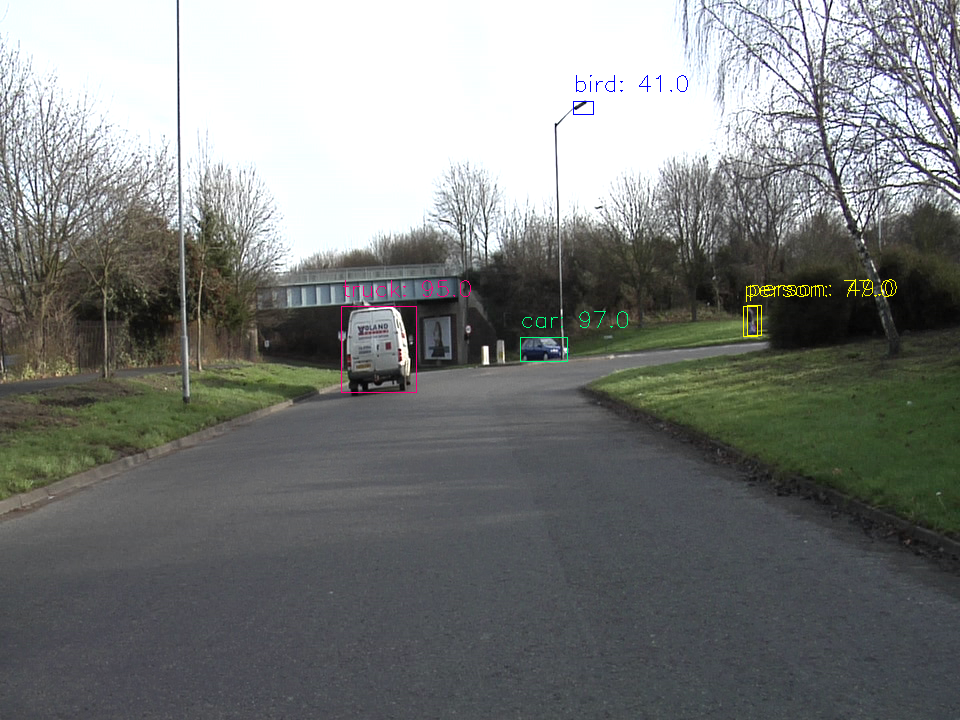

# Semantic Segmentation
### Introduction

The goal of this project was to implement a fully convolutional network to segment images from a dashcam into road and nonroad pixels. I started by converting the provided pre-trained VGG-16 classifier to a fully convolutional network. At the [Udacity Self-Driving Car Nanodegree](https://de.udacity.com/course/self-driving-car-engineer-nanodegree--nd013) the [Kitty Dataset](www.cvlibs.net/datasets/kitti/) was used. After that I used the [Tiramisu](https://arxiv.org/abs/1611.09326) Architecture on the [CamVid Dataset](http://mi.eng.cam.ac.uk/research/projects/VideoRec/CamVid/) and was able to nearly reproduce the accuray defined in the paper.  

|  | 
|:--:| 
| *Results from the Tiramisu Network trained on CamVid with 32 different classes.* |

### Semantic Segmentation

Semantic Segmentation is the process of assigning each pixel of an image to their corresponding class. 
There are a couple of different approaches to perform semantic segmentation
1. One of the first approaches with Deep Learning was patch classification, where each pixel was classified by using a fixed size patch around it. This was par exemple successfully used to segment ["Electron Micrsopy Images"](http://people.idsia.ch/~juergen/nips2012.pdf)
2. The logical next step were the [Fully Convolutional Networks(FCN)](https://arxiv.org/abs/1411.4038). For this type of Architecture  the Fully Connected Layers were replaced by Convolutional Layers. With that adaption in the network architecture, it was possible to handle any input image size.  Derived from the FCN-Architekure two new Architectures are now stat of the Art.

    i. Encoder-Decoder - Architecture
For this Architecture the basic principle is that the encoder gradually reduces the spatial dimensions and aggregates the context information and the decoder recovers the spatial dimensions and object details. In the context off medical image segmentation the [U-Net](https://arxiv.org/abs/1505.04597) is one of the most popular architectures. 

    ii. The second approach uses Dilated convolutions instead of polling layers.
To smooth the final segmentation [Conditional Random Fields](https://arxiv.org/abs/1210.5644) are used and can generelly be used after each Semantic Segmentation Network.  

### Architecture
To perform the conversion from the provided pre-trained VGG-16 network to a fully convolutional network the final fully connected layer were replaced by 1x1 convolutions with the number of filters set to the number of target classes, two in this example (Road, No Road). The MaxPolling layer from the pre-trained network decrease the spatial accuracy, to overcome this, two skip connections performing 1x1 convolutions are implemented at layer **three** and **four**. This two skip connections are added and then via transposed convolution upsampled. Finaly the converted fully connected layer **seven** is first upsampled and then added.     

- kernel_initializer: **random_normal_initializer(stddev=0.01)**
- kernel_regularizer: **l2_regularizer(1e-3)**

|  | 
|:--:| 
| *The provided VGG Network converted to VGG-FCN for this exercise* |

### Training:
- image_shape: 160, 576 (Even if fully connected networks can handle every input size, the accuracy is not the same and the GPU-RAM is limited)
- epochs: 50
- batch_size: 20
- keep_prob: 0.5 (Dropout)
- Optimizier: Adam
- learning_rate: 0.001
- Augmentation: flip
```python
# performe a vertical flip for every second image 
if flip_lr and np.random.choice(2, 1)[0] == 1:
    image = np.fliplr(image)
    gt_image = np.fliplr(gt_image)
```

|  | 
|:--:| 
| *The histograms for the final conv2d_transpose layer* |


### Results:

The following image shows the batch loss for the trainings process. As expected the batch loss is constantly going down and converting to 0.015. 

|  | 
|:--:| 
| *The batch loss development, for 50 or 100 epochs with and without data augmentation* |


| ** | 
|:--:| 
| *The Kitty validation images as gif* |

### [Tiramisu](https://arxiv.org/abs/1611.09326)
**The code to create for the following results are not part of this repository. Because I used methods and techniques that I have partly developed as a Deep Learning Engineer for my current employer the [EUROIMMUN AG](https://www.euroimmun.de/startseite.html). At EUROIMMUN we are using this methods and techniques for example to segment tissue on microscopy images**

The next step from a "simple" road segmentation, was a complete street scene segmentation on the CamVid Dataset with [32](http://mi.eng.cam.ac.uk/research/projects/VideoRec/CamVid/data/label_colors.txt) classes from animal to wall. To perform this task I implemented the Tiramisu architecture, which is currently state of the art, in [Keras](https://keras.io/). For data augmentation the Keras image generator was used for the original image and the mask images to handle both paars of images equali. One of the key features of the augmentation framework was that all or just subclasses could be learned par example just road and road line marks. To Debug the network lerning I developt a [Keras Callback](https://keras.io/callbacks/) thats after a number of epochs the current model uses on the validation images and saves the results to the [Tensorboad](https://www.tensorflow.org/get_started/summaries_and_tensorboard). This was by far the most valuable tool to debug the trainings process.  

### Training:
- image_shape: 224, 224
- epochs: 250
- batch_size: 6
- Optimizier: Adam
- learning_rate: 1e-4, decay=1-0.99995
- loss: categorical_crossentropy
- Augmentation: flip
```python
operations = dict(
    #rotation_range=90.,
    #width_shift_range=0.05,
    #height_shift_range=0.05,
    horizontal_flip=True,
    #vertical_flip=True,
    fill_mode="constant",  # reflect wrap, reflect
    cval=0,
    #zoom_range=0.05
    )
```
| ** | 
|:--:| 
| *The Keras Callback to visualice the training progress* |

### Results:

The pictures in the following table were processed by the Tiramisu and a R-CNN-ResNet Network. The pre-trained R-CNN was used from the [Tensorflow Object Detection API](https://github.com/tensorflow/models/tree/master/research/object_detection). Both Models were hosted for inference at the EUROIMMUN inference service which can be called via http requests. 

| [RCNN-ResNet](https://arxiv.org/abs/1506.01497) | Tiramisu | 
|:--:|:--:| 
| ** | ** |
| ** | ** |
| ** | ** |
| ** | ** |
| ** | ** |
| ** | ** |
| ** | ** |
| ** | ** |
| ** | ** |

The best validation accuracy was around 90% what's around 1% worse that the accuracy mentioned at the original [paper](https://arxiv.org/abs/1611.09326) but way better that I have expected. 

| ** | 
|:--:| 
| *Accuracy on the CamVid Dataset* |

### Open Questions:

Too much data augmentation seems to break the training process for semantic segmentation networks. For example I was able to train the network if I shift or flip the image but unable to train it with both options. 
To overcome this behavior I tried the following:
- learning_rate: Increase or decrease seems to have no effect the accuracy was not going to be as high as without augmentation
- First flip that shift: No effect the accuracy is actually going down after starting to train with shift on a network trained with flip

If someone has a explanation or a tip, I would be happy to receive a message :)

